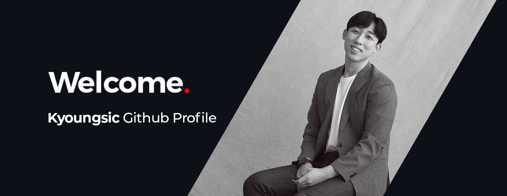

## 👨‍💻 About

- Name : 김경식 (Kyoungsic Kim)
- Birth : 1993.02.27
- E-mail : sick93s@naver.com
- Career : 2018 ~ 2022 웹 퍼블리셔
- [Website](http://kyoungsic.com)

## 🛠 Skills

- Front-end : 
  
  
  
  
  
  
  
  <!--  -->
  <!--  -->
- App :  
- Deployment :  
- Version Control : 
  

## 🥇 Certificate

- 정보처리산업기사
- OCJP(Oracle Certified Java Programmer)
- GTQ 1급 (Adobe Photoshop)
- GTQi 1급 (Adobe Illustrator)
- ITQ O/A Master (Excel, Powerpoint, Word)